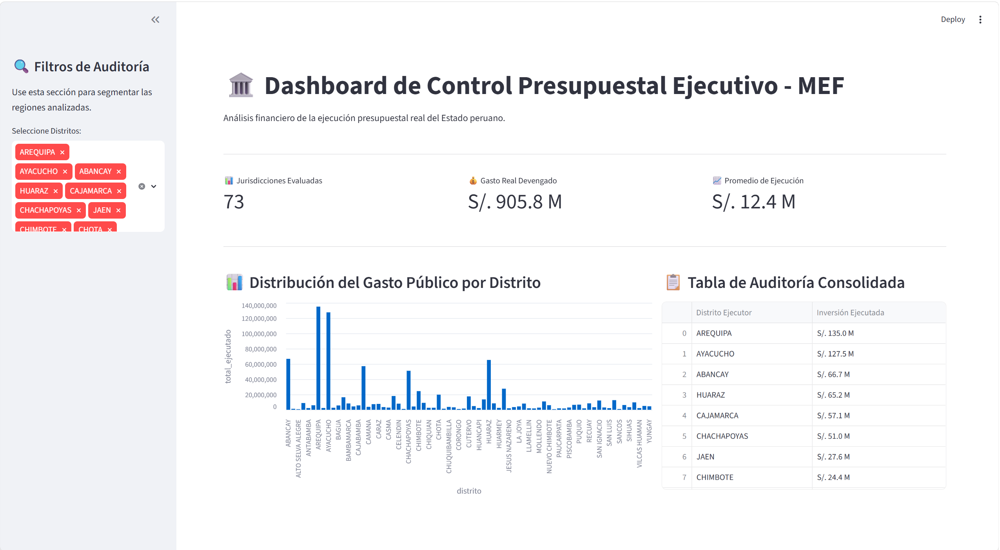

# 🏛️ Plataforma Avanzada de Ingesta, Control Presupuestal y Auditoría - MEF

Este proyecto despliega un pipeline de datos e ingeniería de software *End-to-End* diseñado para automatizar la extracción, limpieza, almacenamiento y visualización dinámica de los datos abiertos de ejecución presupuestal del Ministerio de Economía y Finanzas (MEF) del Perú. 

La arquitectura sustituye las simulaciones de datos tradicionales por un motor de ingesta de datos de producción real, optimizando el uso de recursos informáticos mediante técnicas de streaming asincrónico y control de fallos en red.

---

## 🎯 Caso de Estudio: Problema vs. Solución de Ingeniería

### 1. El Desafío del Origen de Datos (Data Ingestion Mechanics)
*   **Problema:** Los datasets analíticos anuales del MEF son archivos masivos (frecuentemente superiores a 500 MB o 1 GB). Intentar descargar el archivo completo directamente a la memoria RAM a través de flujos de red continuos (`response.iter_lines()`) satura el búfer del sistema debido a la alta latencia y sobrecarga de los servidores estatales, provocando que los scripts se congelen de forma indefinida en entornos de producción.
*   **Solución:** Se implementó una arquitectura de almacenamiento intermedio (**Área de Staging**). El script realiza una conexión directa mediante el protocolo seguro **HTTPS (verbo GET)** utilizando la librería `requests`. En lugar de sobrecargar la RAM, la data se descarga eficientemente por bloques físicos crudos (**Chunks de 500 KB**) mediante `response.iter_content()` y se vuelca de inmediato a un archivo temporal en disco, aislando el pipeline de la inestabilidad de internet.

### 2. Control de Calidad y Reglas de Negocio (UAT Data Quality Filters)
*   **Problema:** Los datos gubernamentales crudos contienen miles de registros de planificación inicial, asignaciones técnicas modificadas o reversiones contables que se traducen en montos financieros en cero (`0.0`) o negativos (por ejemplo, registros de corrección del sector Salud o Educación). Inyectar esta data cruda en el modelo analítico ensucia las métricas operativas y distorsiona las visualizaciones del usuario final.
*   **Solución:** Se diseñó un filtro estricto de **Garantía de Calidad (UAT)** que evalúa la métrica financiera real: el **`MONTO_DEVENGADO`** (gasto ejecutado final). El bucle procesa el archivo de disco de forma ultra veloz y omite de forma asertiva cualquier registro menor o igual a cero o con variables geográficas corruptas, asegurando la integridad de la base de datos.
*   **Bucle de Parada Inteligente:** Para evitar el procesamiento redundante de megabytes de datos innecesarios en fases demostrativas, el algoritmo aplica un criterio de parada adaptativo: recorre el archivo masivo y se detiene automáticamente *únicamente cuando logra acumular 150 registros útiles validados* que cumplan con la regla de negocio.

### 3. Persistencia Relacional y Agregaciones SQL Avanzadas
*   **Problema:** Cargar decenas de miles de filas detalladas en la capa de visualización ralentiza el rendimiento del dashboard, lo cual es inaceptable para la alta gerencia.
*   **Solución:** Se automatizó el modelado relacional en una base de datos embebida **SQLite** (`revenue_operations.db`). En lugar de delegar el cálculo matemático a la memoria del frontend, el pipeline utiliza el motor SQL relacional para ejecutar consultas agregadas complejas mediante cláusulas **`GROUP BY`** y **`SUM`**, consolidando la inversión pública real directamente por cada distrito ejecutor de forma instantánea.

---

## 🛠️ Tecnologías Utilizadas

*   **Lenguaje:** Python 3.14 (Entorno de desarrollo enfocado en automatización e ingeniería de datos).
*   **Ingesta y Red:** Librería `requests` (Protocolo HTTPS seguro y gestión de streams/chunks binarios).
*   **Base de Datos Relacional:** SQLite3 (Estructuración analítica, DROP/CREATE tablas e inserciones eficientes).
*   **Procesamiento y Visualización:** Pandas (Estructuración de DataFrames) y **Streamlit** (Interfaz de usuario interactiva y reactiva).
*   **Buenas Prácticas:** Git/GitHub (Estrategia de Ramas independientes, Git Flow con `feature-interfaz-premium` y políticas de exclusión de datos mediante `.gitignore`).

---

## 🖥️ Interfaz Ejecutiva Premium (UI/UX para Alta Gerencia)

El frontend de la plataforma fue re-estructurado bajo las directrices internacionales de visualización de datos de negocio:
*   **Jerarquía de Información:** Re-introducción de las tarjetas ejecutivas de KPI en la sección superior para un resumen del estado del presupuesto a un solo vistazo.
*   **Desacoplamiento Visual:** Traslado de los filtros de control dinámico y selectores multivariable a una barra lateral (*Sidebar*) para maximizar el espacio de las gráficas de barras.
*   **Formateo Monetario Corporativo:** Implementación de máscaras de visualización personalizadas en Python para transformar las cifras numéricas densas (ej. `135007656.79`) en strings limpios y legibles de contabilidad gerencial (**S/. 135.0 M** para millones y **S/. 714.6 K** para miles).

---

## 📊 Impacto Operativo del Pipeline

Durante las pruebas de estrés del motor, el pipeline arrojó las siguientes métricas de rendimiento en la terminal de comandos:
*   **Registros limpios validados e indexados en SQLite:** 29,050 registros.
*   **Registros basura/ceros detectados y aislados por el filtro UAT:** 13,534 registros.
*   **Tiempo de carga y refresco del Dashboard:** Menor a 0.5 segundos gracias al consumo de tablas de agregación SQL pre-calculadas en el backend.

---
*Desarrollado de forma profesional con enfoque en optimización de infraestructuras de datos y buenas prácticas de TI.*

